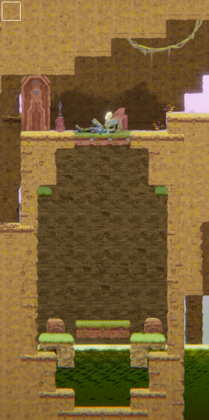
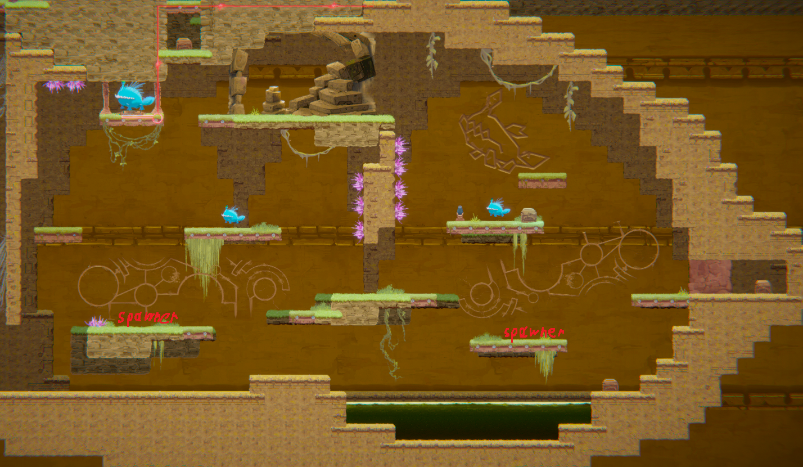

# COMP2150  - Level Design Document
### Name: Rodion Korshunov
### Student number: 47848774

## 1. Player Experience (~700 words)

### 1.1. Discovery

Goal: Lead the player on a journey of discovery, introducing them to the game's mechanics and world naturally and interestingly.
#### Design choices:
Gradual Introduction to Mechanics:  The initial encounter introduces basic mechanics in an isolated area, allowing players to experiment without feeling overwhelmed.  Subsequent encounters 2 and 3 could build on these foundations, introducing novel interactions between previously known mechanics. 

#### Environmental Storytelling:
The gaming world itself can be a teacher.  Environmental riddles, level design that discreetly guides the study, and visual cues provide knowledge without needing written hints.

Safe Experimentation Spaces: My design allows players to put their abilities and new knowledge to the test in a low-risk environment.  This is most noticeable in encounter 1:

If the player fails to jump, he will fall to the platform below, which saves him from falling and losing HP. In addition, this allows the player not only to safely complete this section of the level but also to hone their skills by making 2 jumps, instead of missing one, without rolling back his progress.

The screenshot shows a safe grassy platform, which serves as the player's starting point. The calm environment helps the player relax and familiarize themselves with the movement controls. The first minor obstacle is also presented to the player: a one-block jump, which serves as a quick check to see if he has grasped the basic controls. A closed door on the left indicates the direction from which the player's character came, providing a clear goal for where to proceed next.

The level structure is designed to guide players towards intuitive learning of game mechanics, creating the illusion of self-directed learning without external prompts. By discovering mechanics independently, players experience a sense of accomplishment and ownership over their knowledge. A world that teaches through its design feels more natural and believable.
This approach to discovery through level design fosters a sense of agency and immersion, creating the foundation for a more rewarding and engaging gameplay experience.

### 1.2. Drama

My level creates a gripping experience through a well-crafted intensity curve, where moments of rising tension are balanced by periods of relief.
The game's dramatic pacing includes environmental exploration, combat encounters, puzzles, and safe spaces to create a dynamic gameplay rhythm. The difficulty of encounters also gradually increases as the player progresses. This builds tension and a sense of accomplishment.

Here are some examples of how this is implemented in my game:
Safe zone: The player can explore the area and learn the basic movement controls.

Moment of rising tension (parkour and player training): The player encounters a series of obstacles that require them to use the movement controls in more challenging ways.

Moment of slight relief and world exploration: The player can explore the area and find hidden items (healing box).

Moment of Tension, Enemy Encounter: Enemy encounter is challenging but not overwhelming. Enemies vary in their abilities and attack patterns.

Moment of slight relief and world exploration: The player can explore the area and find hidden items (healing box).

Moment of tension + learning new mechanics: The player encounters a puzzle that requires them to use a new mechanic. The player must use the new mechanic to solve the puzzle and progress.

Moment of slight relief and world exploration: The player can explore the area and find hidden items (healing box).

Moment of tension, Test of the player's skills: The player's skills such as combat, exploration, platforming and puzzle solving are tested simultaneously.

Moment of relief, safety space: Designed as a positive space to make the player feel as comfortable as possible. Also rewards the player for completing the stage with 4 healing boxes. There are columns at the exit, giving the player a sense of control of this space and not expecting an unexpected invasion.

Overall the dynamic pacing allows for moments of both tension and relief, adding emotional depth to the gameplay.

### 1.3. Challenge

3.	New enemy types and mechanics are introduced gradually, allowing players to master concepts before facing more complex challenges.
My level is designed so that enemy attacks are clearly telegraphed, and player abilities provide meaningful counterplay. For example:
The player explores a peaceful cave, unaware of the impending encounter:

The player is given their first weapon and is immediately given a safe opportunity to try it out on an enemy that cannot reach the player:

The player enters a small combat encounter where they can practice the newly learned combat mechanics.

The difficulty of combat encounters increases: There are more enemies, and they are placed in more challenging locations for the player.

The difficulty of combat encounters increases further: Enemies now notice the player from a distance, and they cannot be snuck up on as easily. An enemy with a larger attack radius is introduced, which the player must defeat to progress.

My level presents a fair challenge. The initial peaceful setting creates a sense of security and then introduces enemies with clear visual cues for their attacks. Players can use the skills they have learned to overcome the encounters. Successfully overcoming challenges provides a sense of accomplishment and motivates players to continue. The gradual increase in difficulty encourages players to hone their skills, adapt their strategies and keep the player in the flow channel.

### 1.4. Exploration

The primary goal of player engagement is to encourage players to explore the game world at their own pace, rewarding them with discoveries and memorable locations.
My level features a branching level design. Players have multiple paths they can take to progress through the level, fostering a sense of agency and allowing for different playthroughs. Hidden secrets: Hidden health pickups and memorable locations are scattered throughout the level to reward player exploration. My level is also divided into visually distinct areas. These environments have unique aesthetics and themes to create a sense of place and encourage exploration of every corner. For example, in my level:

The player reaches a fork in the road, where one path leads directly to the next objective, and the other leads to a secret, mysterious area.

While exploring underground caves, the player discovers a hidden room containing a health pickup and a beautiful, memorable view.

The player emerges from the underground tunnels to a view of a grassy landscape, which visually contrasts with the underground area.

## 2. Core Gameplay (~400 words)
Acid:
Early introduction of acid pits teaches players about environmental hazards and the importance of careful movement. Since it's early in the game, the hazard is introduced in a very safe way. If the player makes a mistake, he has a chance to correct it without losing progress. If he makes two mistakes, he is punished by losing his health and returning to the start.

Spikes:
Spikes demonstrate the concept of instant danger zones and the need to avoid them. Introduced early in the level, it's a basic mechanic. If the player jumps too low, he hits the spikes, gets knocked back, and loses health, but does not restart the level, so the player has a chance to try the jump again.

Health pickups:
Usually placed in zones with ‘moments of relief’ and safe areas to show their role in replenishing health lost to hazards or enemies. Also used as a reward for exploring the level.

Pass-through platforms:
Introduce the concept of hidden paths and encourage exploration. First encountered early in the game, but the player likely won't notice it since it's there for convenience. Fully utilized after the health pickup is introduced. Player can go through it for a faster path or go down an alternate path for a reward.

Checkpoints:
Provide a sense of progress and safety at the level. Placed before combat encounters or in safe areas. Players feel confident knowing they won't lose much progress if they fail.

Weapon pickup (Staff):
Introduces the staff as the only combat option at this point. Introduced right before enemies, allowing players to try it out immediately.

Chompers:
The first chomper was introduced right after the staff pickup. Chomper can't reach the player until they engage, allowing safe observation of its mechanics.

Spitters:
Introduce ranged enemies, requiring players to adapt their combat strategy beyond melee. The first spitter is introduced right after the chomper, so the player knows all mob types in advance. Another spitter is placed behind, teaching the player to deal with them working together.

Moving platforms:
Complicate the platforming, encouraging precise movement. Initially introduced one at a time, then combined to increase difficulty.

Weapon pickup (Pistol):
Introduces the pistol as a ranged combat option. Player can immediately use it on a ranged enemy. Later, the player solves a puzzle using the pistol, expanding its potential uses.

  

Key pickup:

## 3. Spatiotemporal Design
A section on Spatiotemporal Design, which includes your molecule diagram and annotated level maps (one for each main section of your level). These diagrams may be made digitally or by hand, but must not be created from screenshots of your game. The annotated level maps should show the structure you intend to build, included game elements, and the path the player is expected to take through the level. Examples of these diagrams are included in the level design lectures.

No additional words are necessary for this section (any words should only be within your images/diagrams).
 
### 3.1. Molecule Diagram

### 3.2. Level Map – Section 1

Green lines - main path

Blue lines - optional path

Yellow lines - Fell but took no damage

Red lines - Wrong action that led to death

### 3.3.	Level Map – Section 2

### 3.4.	Level Map – Section 3

## 4. Iterative Design (~400 words)
Using iterative design was essential in determining my proficiency. Here's how it helped:
Early drawn prototypes:

The level's exploration flow and opponent placement were better visualized with the aid of rough sketches of the layout.
Storyboards for games to come:

The majority of the storyboards were made for the areas that introduced new elements, like difficult jumps, fighting situations, and environment-based puzzles.

Modification considering internal testing:
•	In Unity, a few modifications were made from the original level design sketches:
•	Many platform distances were changed to conform to the character's physics.
•	Additional health pickups were strategically placed in response to early enemy encounters that proved slightly more difficult than anticipated. After that, the sketch was modified to account for these adjustments (for ease).
These iterations show how the level is continuously improved based on different testing and prototyping phases.

The goal for additional development:
The last encounter in the third basement encounter is one place where a more iterative design could be beneficial. At the moment, it entails taking off a few simple mobs as well as a mini-boss with a wide strike radius.
This might be made more challenging by adding a mini-boss with distinct attack patterns that would need to be defeated by carefully using the staff or handgun that player just obtained.
This would improve player preparation for impending challenges and make the encounter more captivating and fascinating.
Through iterative design, my level evolved from a concept into a well-balanced and engaging introduction to the core game mechanics. Further iterations of specific encounters can continue to refine the gameplay and ensure a smooth learning curve for players.

